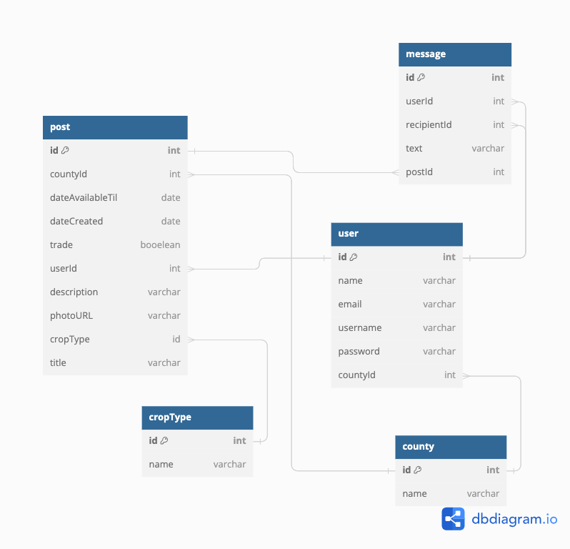

#  Too Much To Can 

## Application Overview

Too Much To Can enables home gardeners across Middle Tennessee to connect and trade their surplus harvests. 

### Problem Solved

Imagine you’re a home gardener who loves growing tomatoes. By the end of the summer, you’re drowning in tomatoes, sick and tired of preserving them, and no one you know will accept another single tomato from you. On top of that, you didn’t plant any basil this season to enjoy with all your tomatoes! 
You hear about an app that allows gardeners to trade their surplus harvests. It’s called ‘Too Much To Can’. You decide to sign up and check it out. You log in and start perusing all the posts from other gardeners. There are so many! You narrow them down by entering the keyword ‘basil’. You’re in luck! Another user in Davidson County has created a post for all of their extra basil, and they want to trade for tomatoes! In the description, they say they are looking for 10 pounds of tomatoes. You send them a message to inquire about a trade. 
Realizing that you have over 80 pounds of tomatoes, you create a new post for the remaining 70 pounds. Since you don’t want any other produce at the moment, you decide to select ‘donate’ instead of ‘trade’. Within minutes, you receive a message from an interested user who wants some of your tomatoes. You reply to arrange a meetup.
Home gardeners often get excited and grow way more food than they know what to do with! ‘Too Much To Can’’ will allow gardeners across Middle TN to connect and trade their homegrown goodies (or give them away). This app enables users to explore the flavors of backyard gardens in their area and reduce food waste!


### Features 
<ul>
<li>Users can create posts for their surplus harvests from their home gardens.</li>
<li>Users can search and filter posts for vegetables, fruits, mushrooms, and other home-grown goodies for trade or for free.</li>
<li>Users can respond to a post by messaging the user who created the post.</li>
<li>Users can view, edit, and delete their posts.</li>
</ul>

### Technologies Used

       

## Running This Application


1. Clone this repository and change to the directory in the terminal.

```sh
    git clone git@github.com:chesney-hardin/too-much-to-can.git
    cd too-much-to-can
```
2. Access the data.

```sh
    git clone git@github.com:chesney-hardin/too-much-to-can-api.git
    cd too-much-to-can-api
    json-server database.json -p 8088
```

3. Launch the client.

```sh
    npm install
    npm start
```

#### Demo User Credentials

*** Warning About Security *** </br>
This application uses mock authentication which is purely for demonstration purposes. Therefore the login and registration code written here is completely insecure and would never be implemented in a professional application.

<p>
Username: <i>chesneyh@aol.com</i>
<br>
Password: <i>strawberry</i>
</p>


#### ERD




#### WireFrame


